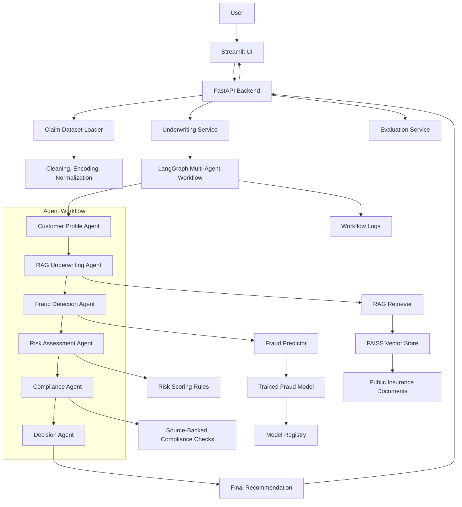

# Architecture

## Summary

RiskWise-AI is a modular Python application that simulates insurance claim underwriting and fraud-risk review. A Streamlit UI lets a user select or submit a claim and ask an underwriting question. A FastAPI backend loads and normalizes claim data, retrieves public insurance guidance through a RAG pipeline, runs a trained fraud model, executes a LangGraph multi-agent workflow, and returns a final recommendation with risk scoring, compliance status, reasoning, source citations, and an agent trace.

The MVP keeps data, RAG, ML, agent orchestration, API, UI, evaluation, and observability boundaries separate. This keeps each implementation stage small enough to review and roll back.

## Mermaid Diagram

## Component Boundaries

- `frontend/`: Streamlit application for claim selection, underwriting question input, decision display, charts, citations, and agent trace.
- `backend/app/main.py`: FastAPI entry point and HTTP API surface.
- `backend/app/data/`: dataset loading, cleaning, preprocessing, and feature engineering.
- `backend/app/ml/`: model training, metrics, registry, and prediction wrappers.
- `backend/app/rag/`: public PDF ingestion, chunking, embeddings, vector storage, and retrieval.
- `backend/app/agents/`: six agent modules and LangGraph workflow orchestration.
- `backend/app/services/`: workflow-facing business services, evaluation, and explainability helpers.
- `backend/app/utils/`: shared logging, PDF loading, and utility helpers.
- `data/`: local dataset, public documents, processed data, and vector indexes.
- `models/`: local model artifacts.
- `tests/`: unit and API tests aligned with each implementation stage.

## Runtime Flow

1. The user selects a claim or submits a claim record in Streamlit.
2. Streamlit calls FastAPI.
3. FastAPI validates the request and loads the claim through the data service.
4. The underwriting service invokes the LangGraph workflow.
5. The customer profile agent summarizes claim, policy, and incident details.
6. The RAG underwriting agent retrieves public guideline context and citations.
7. The fraud detection agent scores fraud probability with the trained model.
8. The risk assessment agent computes a 0-100 risk score.
9. The compliance agent checks whether the recommendation is supported by retrieved sources.
10. The decision agent returns approve, reject, or manual review with reasoning and citations.

## Key Assumptions

- Local development uses Python 3.11.
- The user supplies `data/insurance_claims.csv`; it is not committed by default.
- Public insurance PDFs are stored under `data/raw_documents/`; private company documents are not used.
- FAISS is the MVP vector database. ChromaDB remains an optional later replacement.
- OpenAI models are configured by `OPENAI_API_KEY`, `EMBEDDING_MODEL`, and `LLM_MODEL`.
- Tests must not require a live LLM call; external model and embedding calls are mocked or faked.
- Generated artifacts such as model pickles, FAISS indexes, logs, and raw PDFs are excluded from Git.
- Actual GitHub PR creation and main-branch protection require a configured remote.

## Non-Goals For MVP

- Human-in-the-loop approval UI.
- PDF claim upload.
- Authentication or role-based access control.
- PostgreSQL persistence.
- Kubernetes, Azure OpenAI, Prometheus, Grafana, or CI/CD automation.

